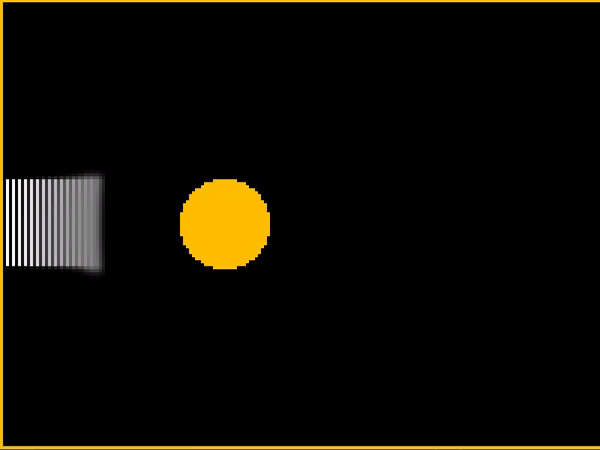

# An Eulerian 2D fluid simulator
This is a practice project for learning more about real-time simulations and implementation of computational solutions for differential equations, in this case a simplified version of the Navier-Stokes equations.
The visualization of the simulator is done using an OpenGL project i'd developed earlier.

## Here's a short demo


## Dependencies
The following libraries and files should be placed in a folder named 'Libraries' in the project path:
GLFW: 
```
./Libraries/lib/glfw3.lib
./Libraries/Include/GLFW/[GLFW built headers]
./Libraries/Include/glm/[glm build headers]
./Libraries/Include/glad[glad build headers]
./Libraries/glad.c
./Libraries/stb_image.h
```

## refrences:
Matthias Müller's ten minute physics [tutorials](https://matthias-research.github.io/pages/tenMinutePhysics/index.html)<br/>
Cline, David, David L. Cardon, Parris K. Egbert and Brigham Young. “Fluid Flow for the Rest of Us : Tutorial of the Marker and Cell Method in Computer Graphics.” (2005). [link to paper](https://www.semanticscholar.org/paper/Fluid-Flow-for-the-Rest-of-Us-%3A-Tutorial-of-the-and-Cline-Cardon/9d471060d6c48308abcc98dbed850a39dbfea683?p2df)
